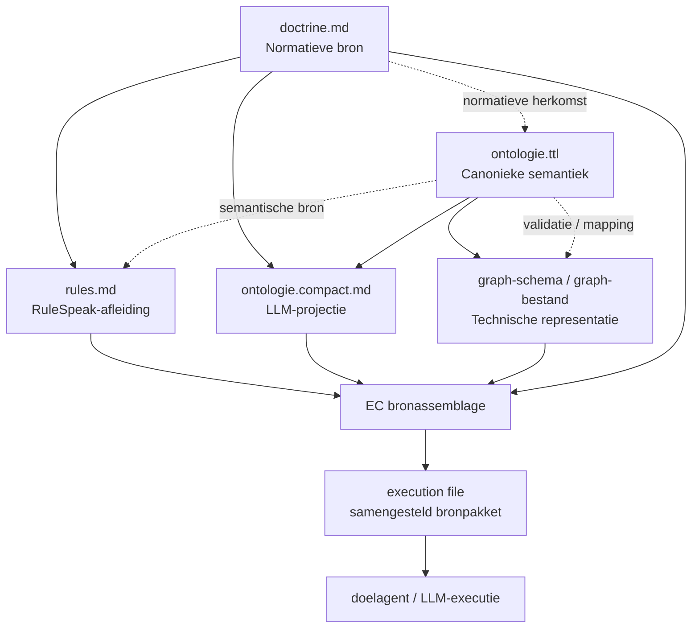
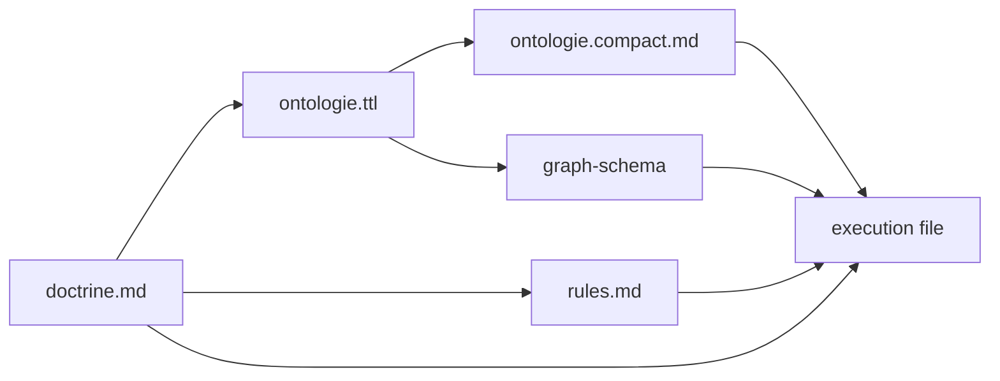

# Bronafleiding-architectuur

Dit document beschrijft de architectuur van bronafleiding: hoe normatieve bronnen worden getransformeerd en samengesteld tot execution files voor LLM-agents.

## Relevante bestanden

| Artefact | Locatie |
|----------|---------|
| Doctrine-bestanden | [doctrine.bronhouding-en-exploratie.md](doctrine.bronhouding-en-exploratie.md), [doctrine.traceability.md](doctrine.traceability.md), [doctrine.handoff.md](doctrine.handoff.md) |
| Ontologie (TTL) | [ontologie.ttl](ontologie.ttl) |
| Ontologie (compact) | [ontologie.compact.md](ontologie.compact.md) |
| Graph-schema | [graph/mandarin-schema.cypher](graph/mandarin-schema.cypher) |
| Graph-model | [graph/mandarin-model.md](graph/mandarin-model.md) |

## Flowchart

## Flow - links rechts

