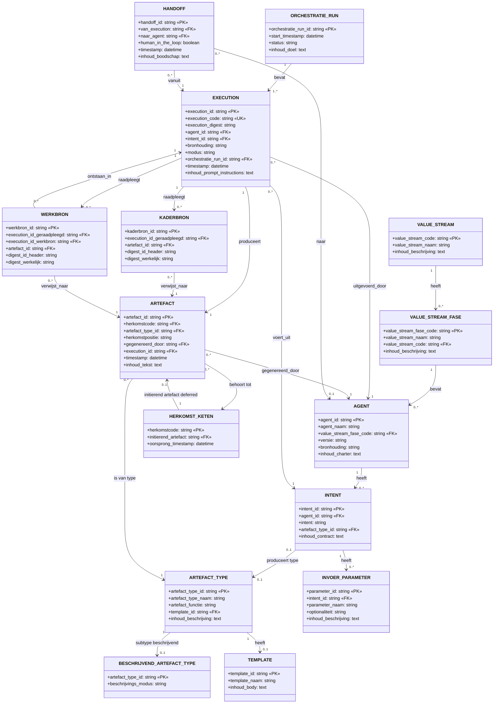

# Target Data Model — Mandarin Sleutelset (3NF)

**Status**: Afgeleid van LDM  
**Versie**: 1.2.0  
**Datum**: 2026-04-12  
**Bron**: `ldm-mandarin.md`

---

## 1. Inleiding

Dit document is automatisch afgeleid van het Logisch Data Model (`ldm-mandarin.md`) via `scripts/erd_to_class.py`. Het bevat 15 entiteiten.

---

## 2. Visueel Model

---

## 3. Entiteitdefinities

### 3.1 VALUE_STREAM

| Attribuut | Type | Sleutel | NN | Beschrijving |
|-----------|------|---------|----|----|
| `value_stream_code` | string | PK | ✓ | Afkorting: fnd, aeo, sfw, ... |
| `value_stream_naam` | string |  | ✓ | Volledige naam van de value stream |
| `inhoud_beschrijving` | text |  |  | Definitie en doel van de waardestroom |

---

### 3.2 VALUE_STREAM_FASE

| Attribuut | Type | Sleutel | NN | Beschrijving |
|-----------|------|---------|----|----|
| `value_stream_fase_code` | string | PK | ✓ | Compound: <value_stream_code>.<fase_nr> bijv. sfw.01, fnd.02 (BR-012) |
| `value_stream_naam` | string |  | ✓ | Beschrijvende naam van de fase |
| `value_stream_code` | string | FK |  | → VALUE_STREAM.value_stream_code (**N1**: expliciete decompositie compound PK) |
| `inhoud_beschrijving` | text |  |  | Omschrijving van wat deze fase behelst |

---

### 3.3 TEMPLATE

| Attribuut | Type | Sleutel | NN | Beschrijving |
|-----------|------|---------|----|----|
| `template_id` | string | PK | ✓ | Betekenisloos 3-cijferig nummer (BR-015) |
| `template_naam` | string |  | ✓ | Beschrijvende naam van de template |
| `inhoud_body` | text |  | ✓ | De templatetekst zelf (structurerende inhoud) |

---

### 3.4 ARTEFACT_TYPE

| Attribuut | Type | Sleutel | NN | Beschrijving |
|-----------|------|---------|----|----|
| `artefact_type_id` | string | PK | ✓ | Betekenisloos 3-cijferig nummer (BR-029) |
| `artefact_type_naam` | string |  | ✓ | Naam: concept, doctrine, essay, handoff, ... |
| `artefact_functie` | string |  | ✓ | (BR-030): normerend \ |
| `template_id` | string | FK |  | → TEMPLATE.template_id (optioneel, 1:1 per §3.6a TDM) |
| `inhoud_beschrijving` | text |  |  | Definitie en toepassing van dit artefacttype |

---

### 3.5 BESCHRIJVEND_ARTEFACT_TYPE

| Attribuut | Type | Sleutel | NN | Beschrijving |
|-----------|------|---------|----|----|
| `artefact_type_id` | string | PK | ✓ | → ARTEFACT_TYPE.artefact_type_id; bestaat uitsluitend voor types met artefact_functie = 'beschrijvend' |
| `beschrijvings_modus` | string |  | ✓ | (BR-032): verkennend \ |

---

### 3.6 AGENT

| Attribuut | Type | Sleutel | NN | Beschrijving |
|-----------|------|---------|----|----|
| `agent_id` | string | PK | ✓ | Compound: <value_stream>.<versie>.<naam> (BR-013) |
| `agent_naam` | string |  | ✓ | Korte, leesbare naam |
| `value_stream_fase_code` | string | FK |  | → VALUE_STREAM_FASE.value_stream_fase_code |
| `versie` | string |  | ✓ | Semantische versie (semver) |
| `bronhouding` | string |  | ✓ | (BR-028): input-gebonden \ |
| `inhoud_charter` | text |  | ✓ | Agent charter: capabilities, gedragscontract en grenzen |

---

### 3.7 INTENT

| Attribuut | Type | Sleutel | NN | Beschrijving |
|-----------|------|---------|----|----|
| `intent_id` | string | PK | ✓ | Compound: <agent_id>.<intent> (BR-014) |
| `agent_id` | string | FK |  | → AGENT.agent_id |
| `intent` | string |  | ✓ | Naam van de intent |
| `artefact_type_id` | string | FK |  | → ARTEFACT_TYPE.artefact_type_id (optioneel) |
| `inhoud_contract` | text |  | ✓ | Intentcontract: precondities, postcondities, verwachte output en gedragsregels |

---

### 3.8 INVOER_PARAMETER

| Attribuut | Type | Sleutel | NN | Beschrijving |
|-----------|------|---------|----|----|
| `parameter_id` | string | PK | ✓ | Betekenisloos 4-cijferig nummer (BR-016) |
| `intent_id` | string | FK |  | → INTENT.intent_id |
| `parameter_naam` | string |  | ✓ | Naam van de parameter |
| `optionaliteit` | string |  | ✓ | verplicht (default) \ |
| `inhoud_beschrijving` | text |  |  | Toelichting op de parameter |

---

### 3.9 ORCHESTRATIE_RUN

| Attribuut | Type | Sleutel | NN | Beschrijving |
|-----------|------|---------|----|----|
| `orchestratie_run_id` | string | PK | ✓ | Pipeline-identifier: run-JJMM.XXXX (BR-011) |
| `start_timestamp` | datetime |  | ✓ | Starttijdstip van de run (ISO 8601) |
| `status` | string |  | ✓ | (BR-021): running \ |
| `inhoud_doel` | text |  |  | Doel en scope van deze orchestratierun |

---

### 3.10 EXECUTION

| Attribuut | Type | Sleutel | NN | Beschrijving |
|-----------|------|---------|----|----|
| `execution_id` | string | PK | ✓ | Kern-id: JJMM.XXXX |
| `execution_code` | string | UK |  | Afgeleid externe referentie: exec- + execution_id (BR-005) |
| `execution_digest` | string |  | ✓ | Inhoudsgebonden hash/digest |
| `agent_id` | string | FK |  | → AGENT.agent_id |
| `intent_id` | string | FK |  | → INTENT.intent_id |
| `bronhouding` | string |  | ✓ | (BR-028); bewaard als event-sourcing gegeven (N7) |
| `modus` | string |  | ✓ | (BR-020): handmatig \ |
| `orchestratie_run_id` | string | FK | ✓ | → ORCHESTRATIE_RUN.orchestratie_run_id — verplicht, NOT NULL (N3) |
| `timestamp` | datetime |  | ✓ | Uitvoeringstijdstip (ISO 8601) |
| `inhoud_prompt_instructions` | text |  | ✓ | De gebruikte prompt en instructies voor deze execution |

---

### 3.11 HERKOMST_KETEN

| Attribuut | Type | Sleutel | NN | Beschrijving |
|-----------|------|---------|----|----|
| `herkomstcode` | string | PK | ✓ | Ketenidentifier: JJMM.XXXX (BR-001, BR-004) |
| `initierend_artefact` | string | FK |  | → ARTEFACT.artefact_id **[deferred constraint — N6]** |
| `oorsprong_timestamp` | datetime |  | ✓ | Tijdstip van keten-initiatie (ISO 8601) |

---

### 3.12 ARTEFACT

| Attribuut | Type | Sleutel | NN | Beschrijving |
|-----------|------|---------|----|----|
| `artefact_id` | string | PK | ✓ | Pad-onafhankelijke identifier: art-JJMM.XXXX (BR-010) |
| `herkomstcode` | string | FK |  | → HERKOMST_KETEN.herkomstcode |
| `artefact_type_id` | string | FK |  | → ARTEFACT_TYPE.artefact_type_id |
| `herkomstpositie` | string |  | ✓ | (BR-018): initierend \ |
| `gegenereerd_door` | string | FK |  | → AGENT.agent_id |
| `execution_id` | string | FK |  | → EXECUTION.execution_id — producerende execution; uniek (1:1 per **N8**) |
| `timestamp` | datetime |  | ✓ | Creatietijdstip (ISO 8601) |
| `inhoud_tekst` | text |  |  | Volledige inhoudstekst van het artefact |

---

### 3.13 HANDOFF

| Attribuut | Type | Sleutel | NN | Beschrijving |
|-----------|------|---------|----|----|
| `handoff_id` | string | PK | ✓ | Overdrachtsidentifier: hf-JJMM.NNNN (BR-006) |
| `van_execution` | string | FK |  | → EXECUTION.execution_id |
| `naar_agent` | string | FK |  | → AGENT.agent_id (NULL wanneer human_in_the_loop = TRUE, zie BR-009) |
| `human_in_the_loop` | boolean |  | ✓ | TRUE bij menselijke interventie, anders FALSE |
| `timestamp` | datetime |  | ✓ | Overdrachtstijdstip (ISO 8601) |
| `inhoud_boodschap` | text |  |  | Overdrachtscontext en instructies voor de ontvangende agent |

---

### 3.14 KADERBRON

| Attribuut | Type | Sleutel | NN | Beschrijving |
|-----------|------|---------|----|----|
| `kaderbron_id` | string | PK | ✓ | Betekenisloos 8-cijferig nummer (BR-017) |
| `execution_id_geraadpleegd` | string | FK |  | → EXECUTION.execution_id |
| `artefact_id` | string | FK |  | → ARTEFACT.artefact_id |
| `digest_id_header` | string |  |  | Verwachte digest (uit header/referentie van het geraadpleegde artefact) |
| `digest_werkelijk` | string |  |  | Actuele digest op raadpleegmoment |

---

### 3.15 WERKBRON

| Attribuut | Type | Sleutel | NN | Beschrijving |
|-----------|------|---------|----|----|
| `werkbron_id` | string | PK | ✓ | Betekenisloos 8-cijferig nummer (BR-019) |
| `execution_id_geraadpleegd` | string | FK |  | → EXECUTION.execution_id (execution die de bron raadpleegde) |
| `execution_id_werkbron` | string | FK |  | → EXECUTION.execution_id (execution waarin de bron oorspronkelijk is ontstaan) |
| `artefact_id` | string | FK |  | → ARTEFACT.artefact_id |
| `digest_id_header` | string |  |  | Verwachte digest (uit header/referentie) |
| `digest_werkelijk` | string |  |  | Actuele digest op raadpleegmoment |

---

## Wijzigingslog

| Datum | Versie | Wijziging | Auteur |
|-------|--------|-----------|--------|
| 2026-04-12 | 1.2.0 | Gegenereerd vanuit `ldm-mandarin.md` via `erd_to_class.py` | script |
