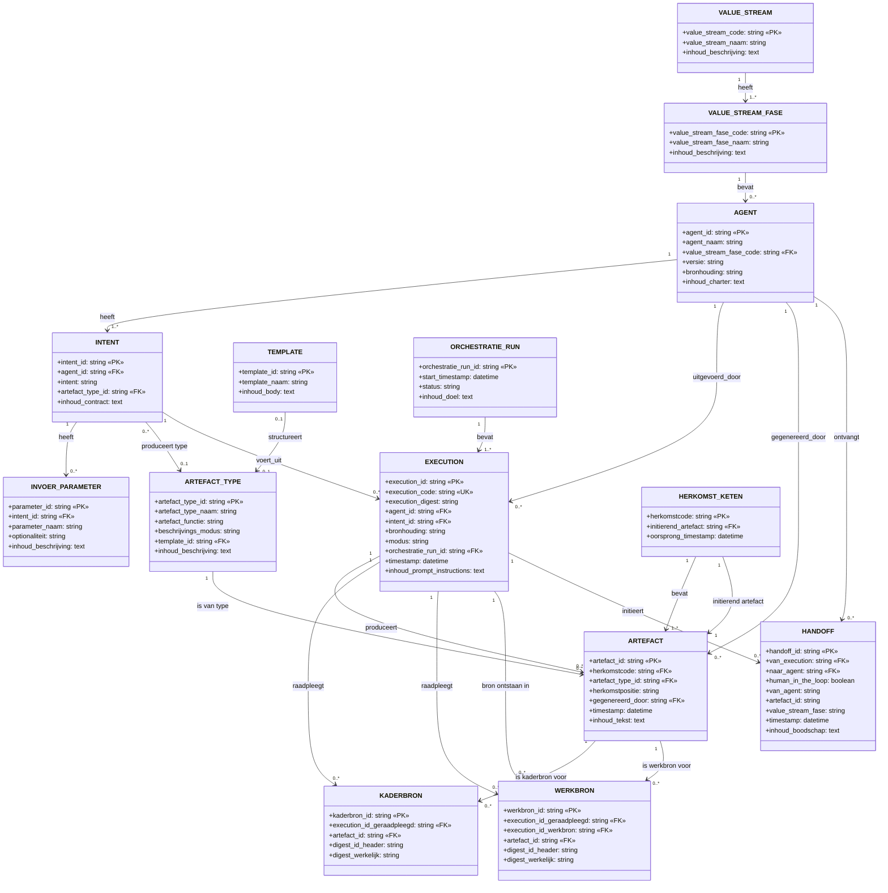

# Target Data Model: Mandarin Sleutelset

**Status**: Definitief ontwerp  
**Versie**: 1.1  
**Datum**: 2026-04-12

---

## 1. Inleiding

Dit document beschrijft het datamodel voor de Mandarin sleutelset. Het model ondersteunt traceability, handoffs, bronregistratie en governance binnen het Mandarin-ecosysteem.

### 1.1 Ontwerpprincipes

Het datamodel is gebouwd op het principe van **loose coupling** door identificatie op te splitsen in orthogonale dimensies:

| Dimensie | Vraag | Sleutel(s) |
|----------|-------|------------|
| Verticale ketenidentiteit | Waar komt een artefactketen vandaan? | `herkomstcode`, `herkomstpositie` |
| Technische uitvoeringsidentiteit | Welke concrete execution heeft dit geproduceerd? | `execution_id`, `execution_code`, `execution_digest` |
| Horizontale overdrachtsidentiteit | Welke handoff heeft context overgedragen? | `handoff_id` |
| Context- en classificatiesleutels | Wie deed wat, in welke context? | `agent_id`, `intent_id`, `bronhouding`, `modus` |
| Structuursleutels | Welke vorm moet de output hebben? | `artefact_type_id`, `template_id` |
| Bronregistratie | Welke bronnen zijn geraadpleegd? | `kaderbron_id`, `werkbron_id` |

---

## 2. Visueel Model



    VALUE_STREAM {
        string value_stream_code PK "fnd|aeo|sfw|..."
        string value_stream_naam "naam"
        text inhoud_beschrijving
    }

    VALUE_STREAM_FASE {
        string value_stream_fase_code PK "sfw.01|fnd.02|..."
        string value_stream_fase_naam "naam"
        text inhoud_beschrijving
    }

    TEMPLATE {
        string template_id PK "NNN"
        string template_naam "naam"
        text inhoud_body "NN"
    }

    ARTEFACT_TYPE {
        string artefact_type_id PK "NNN"
        string artefact_type_naam "concept|doctrine|essay|..."
        string artefact_functie "normerend|structurerend|vastleggend|realiserend|evaluerend|beschrijvend"
        string beschrijvings_modus "verkennend|verantwoordend"
        string template_id FK "NNN (optioneel)"
        text inhoud_beschrijving
    }

    ARTEFACT {
        string artefact_id PK "art-JJMM.XXXX"
        string herkomstcode FK "JJMM.XXXX (keten)"
        string artefact_type_id FK "NNN"
        string herkomstpositie "initierend|voortbouwend"
        string gegenereerd_door FK "agent_id"
        datetime timestamp "ISO 8601"
        text inhoud_tekst
    }

    EXECUTION {
        string execution_id PK "JJMM.XXXX (kern)"
        string execution_code UK "exec-JJMM.XXXX"
        string execution_digest "hash/digest"
        string agent_id FK "agent_id"
        string intent_id FK "intent_id"
        string bronhouding "input-gebonden|canon-gebonden|..."
        string modus "handmatig|tool-ondersteund"
        string orchestratie_run_id FK "run-JJMM.XXXX"
        datetime timestamp "ISO 8601"
        text inhoud_prompt_instructions "NN"
    }

    KADERBRON {
        string kaderbron_id PK "NNNNNNNN"
        string execution_id_geraadpleegd FK "exec waar geraadpleegd"
        string artefact_id FK "art-JJMM.XXXX"
        string digest_id_header "verwachte digest"
        string digest_werkelijk "actuele digest"
    }

    WERKBRON {
        string werkbron_id PK "NNNNNNNN"
        string execution_id_geraadpleegd FK "exec waar geraadpleegd"
        string execution_id_werkbron FK "exec waar ontstaan"
        string artefact_id FK "art-JJMM.XXXX"
        string digest_id_header "verwachte digest"
        string digest_werkelijk "actuele digest"
    }

    HANDOFF {
        string handoff_id PK "hf-JJMM.NNNN"
        string van_execution FK "exec-JJMM.XXXX"
        string naar_agent FK "agent_id (optioneel)"
        boolean human_in_the_loop "TRUE|FALSE"
        string van_agent "agent_id [denorm]"
        string artefact_id "art-JJMM.XXXX [denorm]"
        string value_stream_fase "vs.fase [denorm]"
        datetime timestamp "ISO 8601"
        text inhoud_boodschap
    }

    HERKOMST_KETEN {
        string herkomstcode PK "JJMM.XXXX"
        string initierend_artefact FK "art-JJMM.XXXX"
        datetime oorsprong_timestamp "ISO 8601"
    }

    AGENT {
        string agent_id PK "vs.versie.naam"
        string agent_naam "korte naam"
        string value_stream_fase_code FK "sfw.01|fnd.02|..."
        string versie "semver"
        string bronhouding "input-gebonden|canon-gebonden|..."
        text inhoud_charter "NN"
    }

    INTENT {
        string intent_id PK "agent.intent"
        string agent_id FK
        string intent "intentnaam"
        string artefact_type_id FK "NNN"
        text inhoud_contract "NN"
    }

    INVOER_PARAMETER {
        string parameter_id PK "NNNN"
        string intent_id FK "agent.intent"
        string parameter_naam "naam"
        string optionaliteit "verplicht|optioneel"
        text inhoud_beschrijving
    }

    ORCHESTRATIE_RUN {
        string orchestratie_run_id PK "run-JJMM.XXXX"
        datetime start_timestamp "ISO 8601"
        string status "running|completed|failed"
        text inhoud_doel
    }

    %% ═══════════════════════════════════════════════════════════════
    %% RELATIES
    %% ═══════════════════════════════════════════════════════════════

    VALUE_STREAM ||--o{ VALUE_STREAM_FASE : "heeft"
    VALUE_STREAM_FASE ||--o{ AGENT : "bevat"
    
    HERKOMST_KETEN ||--o{ ARTEFACT : "bevat"
    ARTEFACT }o--|| AGENT : "gegenereerd_door"
    ARTEFACT }o--o| ARTEFACT_TYPE : "is van type"
    
    ARTEFACT_TYPE }o--o| TEMPLATE : "heeft"
    
    EXECUTION ||--o{ ARTEFACT : "produceert"
    EXECUTION }o--|| AGENT : "uitgevoerd_door"
    EXECUTION }o--|| INTENT : "voert_uit"
    EXECUTION ||--o{ KADERBRON : "raadpleegt"
    EXECUTION ||--o{ WERKBRON : "raadpleegt"
    
    KADERBRON }o--|| ARTEFACT : "verwijst_naar"
    WERKBRON }o--|| ARTEFACT : "verwijst_naar"
    WERKBRON }o--|| EXECUTION : "ontstaan_in"
    
    HANDOFF }o--|| EXECUTION : "vanuit"
    HANDOFF }o--o| AGENT : "naar"
    
    AGENT ||--o{ INTENT : "heeft"
    INTENT ||--o{ INVOER_PARAMETER : "heeft"
    INTENT }o--o| ARTEFACT_TYPE : "produceert type"
    
    ORCHESTRATIE_RUN ||--|{ EXECUTION : "bevat"
```

---

## 3. Entiteitdefinities

### 3.1 VALUE_STREAM

**Definitie**: Een value stream is een logische groepering van activiteiten die samen waarde leveren binnen het Mandarin-ecosysteem.

| Attribuut | Type | Sleutel | Beschrijving |
|-----------|------|---------|--------------|
| `value_stream_code` | string | PK | Afkorting van de value stream (`fnd`, `aeo`, `sfw`, etc.) |
| `value_stream_naam` | string | | Volledige naam van de value stream |
| `inhoud_beschrijving` | text | | Definitie en doel van de waardestroom |

**Voorbeelden**: `fnd` (Foundation), `aeo` (Agent Engineering & Operations), `sfw` (Software Development)

---

### 3.2 VALUE_STREAM_FASE

**Definitie**: Een fase binnen een value stream die een specifiek stadium of domein van activiteit aanduidt.

| Attribuut | Type | Sleutel | Beschrijving |
|-----------|------|---------|--------------|
| `value_stream_fase_code` | string | PK | Compound code: `<value_stream>.<fase>` (bijv. `sfw.01`, `fnd.02`) |
| `value_stream_fase_naam` | string | | Beschrijvende naam van de fase |
| `inhoud_beschrijving` | text | | Omschrijving van wat deze fase behelst |

**Relaties**: Behoort tot één VALUE_STREAM.

---

### 3.3 AGENT

**Definitie**: Een mandarin-agent is een afgebakende actor met een eigen charter, verantwoordelijkheden en capabilities.

| Attribuut | Type | Sleutel | Beschrijving |
|-----------|------|---------|--------------|
| `agent_id` | string | PK | Formele identifier: `<value_stream>.<versie>.<naam>` |
| `agent_naam` | string | | Korte, leesbare naam |
| `value_stream_fase_code` | string | FK | Fase waarin de agent opereert |
| `versie` | string | | Semantische versie (semver) |
| `bronhouding` | string | | Standaard bronregime: `input-gebonden`, `canon-gebonden`, etc. |
| `inhoud_charter` | text | | Agent charter: capabilities, gedragscontract en grenzen |

**Loose coupling-bijdrage**: Agentidentiteit is contextueel en beschrijvend, maar niet de enige technische sleutel. Hierdoor hoeft de herkomstcode geen agentinformatie te dragen.

---

### 3.4 INTENT

**Definitie**: Een intent is een expliciete capability of handeling die door een agent kan worden uitgevoerd. Het compound `agent_id.intent` vormt een routeerbaar capability-adres.

| Attribuut | Type | Sleutel | Beschrijving |
|-----------|------|---------|--------------|
| `intent_id` | string | PK | Compound key: `<agent_id>.<intent>` |
| `agent_id` | string | FK | Verwijzing naar de owning agent |
| `intent` | string | | Naam van de intent |
| `artefact_type_id` | string | FK | Standaard artefact-type voor output van deze intent |
| `inhoud_contract` | text | | Intentcontract: precondities, postcondities, verwachte output en gedragsregels |

**Loose coupling-bijdrage**: Capabilities zijn expliciet benoemd los van runner-implementatie. Dezelfde agent kan meerdere intents hebben zonder dat de execution-identiteit daarop alleen hoeft te leunen.

---

### 3.5 INVOER_PARAMETER

**Definitie**: Een invoerparameter is een benoemde invoer die aan een intent kan worden meegegeven bij aanroep.

| Attribuut | Type | Sleutel | Beschrijving |
|-----------|------|---------|--------------|
| `parameter_id` | string | PK | Betekenisloos 4-cijferig nummer |
| `intent_id` | string | FK | Intent waartoe de parameter behoort |
| `parameter_naam` | string | | Naam van de parameter |
| `optionaliteit` | string | | `verplicht` (default) of `optioneel` |
| `inhoud_beschrijving` | text | | Toelichting op de parameter |

**Relaties**: Behoort tot één INTENT.

---

### 3.6 ARTEFACT_TYPE

**Definitie**: Een artefact-type classificeert een Mandarin-artefact naar soort, functie en eventuele beschrijvingsmodus. Het is de expliciete classificatiesleutel die bepaalt wat een artefact is, welke rol het vervult en — indien beschrijvend — hoe het beschrijft.

| Attribuut | Type | Sleutel | Beschrijving |
|-----------|------|---------|--------------|
| `artefact_type_id` | string | PK | Betekenisloos 3-cijferig nummer |
| `artefact_type_naam` | string | | Naam van het type: `concept`, `doctrine`, `essay`, etc. |
| `artefact_functie` | string | | Functionele rol: `normerend`, `structurerend`, `vastleggend`, `realiserend`, `evaluerend` of `beschrijvend` |
| `beschrijvings_modus` | string | | Modus van beschrijving: `verkennend` of `verantwoordend` — uitsluitend gevuld als `artefact_functie = beschrijvend` |
| `template_id` | string | FK | Verwijzing naar de bijbehorende template (optioneel, 1:1) |
| `inhoud_beschrijving` | text | | Definitie en toepassing van dit artefacttype |

**Bedrijfsregel**: `beschrijvings_modus` is ALLEEN gevuld wanneer `artefact_functie = 'beschrijvend'`. In alle andere gevallen is het veld leeg.

**Loose coupling-bijdrage**: Classificatie (wat iets is), functie (welke rol het vervult) en vorm (welke template het volgt) zijn gescheiden dimensies. Wijziging van één dimensie vereist geen wijziging van de anderen.

---

### 3.6a TEMPLATE

**Definitie**: Een template specificeert de vereiste structuur en vorm van output voor een artefact-type. Een template is altijd gekoppeld aan precies één ARTEFACT_TYPE (1:1).

| Attribuut | Type | Sleutel | Beschrijving |
|-----------|------|---------|--------------|
| `template_id` | string | PK | Betekenisloos 3-cijferig nummer |
| `template_naam` | string | | Beschrijvende naam van de template |
| `inhoud_body` | text | | De templatetekst zelf (structurerende inhoud) |

**Loose coupling-bijdrage**: Vormvereisten zijn gescheiden van de classificatie en van uitvoeringsidentiteit. Structurele eisen zitten niet verborgen in prompttekst of bestandsnaam.

---

### 3.7 ARTEFACT

**Definitie**: Een artefact is een concreet output-object geproduceerd door een execution, zoals een concept, doctrine, essay of navigatiebestand.

| Attribuut | Type | Sleutel | Beschrijving |
|-----------|------|---------|--------------|
| `artefact_id` | string | PK | Pad-onafhankelijke identifier: `art-JJMM.XXXX` |
| `herkomstcode` | string | FK | Verwijzing naar de oorsprongsketen |
| `artefact_type_id` | string | FK | Verwijzing naar het artefact-type (classificatie + functie) |
| `herkomstpositie` | string | | Positie in keten: `initierend` of `voortbouwend` |
| `gegenereerd_door` | string | FK | Agent die het artefact heeft geproduceerd |
| `timestamp` | datetime | | Creatietijdstip (ISO 8601) |
| `inhoud_tekst` | text | | Volledige inhoudstekst van het artefact |

**Loose coupling-bijdrage**: De `artefact_id` is pad-onafhankelijk. Verplaatsing van bestanden verbreekt de logische identiteit niet. De classificatie zit in ARTEFACT_TYPE, niet in de identifier zelf.

---

### 3.8 HERKOMST_KETEN

**Definitie**: Een herkomstketen representeert de oorsprong en verticale traceability van een reeks artefacten.

| Attribuut | Type | Sleutel | Beschrijving |
|-----------|------|---------|--------------|
| `herkomstcode` | string | PK | Ketenidentifier: `JJMM.XXXX` |
| `initierend_artefact` | string | FK | Eerste artefact in de keten |
| `oorsprong_timestamp` | datetime | | Tijdstip van keten-initiatie (ISO 8601) |

**Waarom bestaat deze entiteit**:
- Om te kunnen zeggen waar een keten begonnen is
- Om voortbouwende artefacten aan dezelfde oorsprong te blijven koppelen
- Om audit en herleidbaarheid over langere tijd mogelijk te maken

**Loose coupling-bijdrage**: De herkomstcode is losgekoppeld van pad, bestandsnaam en runner-implementatie. De code blijft gelijk, ook als execution-bundels of opslaglocaties veranderen.

---

### 3.9 EXECUTION

**Definitie**: Een execution is een concrete technische uitvoering van een intent door een agent, resulterend in een of meer artefacten.

| Attribuut | Type | Sleutel | Beschrijving |
|-----------|------|---------|--------------|
| `execution_id` | string | PK | Compacte kern-id: `JJMM.XXXX` |
| `execution_code` | string | UK | Externe referentie: `exec-JJMM.XXXX` |
| `execution_digest` | string | | Inhoudsgebonden hash/digest |
| `agent_id` | string | FK | Uitvoerende agent |
| `intent_id` | string | FK | Uitgevoerde intent |
| `bronhouding` | string | | Epistemisch regime voor deze execution |
| `modus` | string | | Uitvoeringswijze: `handmatig` of `tool-ondersteund` |
| `orchestratie_run_id` | string | FK | Pipeline-correlatie — elke execution behoort tot exact één ORCHESTRATIE_RUN |
| `timestamp` | datetime | | Uitvoeringstijdstip (ISO 8601) |
| `inhoud_prompt_instructions` | text | | De gebruikte prompt en instructies voor deze execution |

**Sleutelonderscheid**:
- `execution_id`: korte interne kern-id voor compacte referenties
- `execution_code`: externe identifier met `exec-` prefix voor onderscheidbaarheid
- `execution_digest`: inhoudsanker voor stabiele koppeling aan trace-bestanden

**Loose coupling-bijdrage**: De relatie tussen execution en trace is niet alleen afhankelijk van pad of bestandsnaam, maar ook van `execution_digest`. Verplaatsing van bestanden verbreekt de koppeling niet.

---

### 3.10 KADERBRON

**Definitie**: Een kaderbron is een canoniek artefact (doctrine, constitutie, glossary) dat tijdens een execution is geraadpleegd als normatieve grondslag.

| Attribuut | Type | Sleutel | Beschrijving |
|-----------|------|---------|--------------|
| `kaderbron_id` | string | PK | Betekenisloos 8-cijferig nummer |
| `execution_id_geraadpleegd` | string | FK | Execution waarin de bron werd geraadpleegd |
| `artefact_id` | string | FK | Het geraadpleegde artefact |
| `digest_id_header` | string | | Verwachte digest (uit header/referentie) |
| `digest_werkelijk` | string | | Actuele digest van het geraadpleegde bestand |

**Waarom bestaat deze entiteit**:
- Om epistemische discipline te borgen: welke canonieke bronnen zijn daadwerkelijk geraadpleegd?
- Om discrepanties te detecteren tussen verwachte en actuele versies van kaderbronnen
- Om auditspoor te leveren voor canon-gebonden executions

---

### 3.11 WERKBRON

**Definitie**: Een werkbron is een niet-canoniek artefact (werk van een eerdere execution) dat tijdens een execution is geraadpleegd als input.

| Attribuut | Type | Sleutel | Beschrijving |
|-----------|------|---------|--------------|
| `werkbron_id` | string | PK | Betekenisloos 8-cijferig nummer |
| `execution_id_geraadpleegd` | string | FK | Execution waarin de bron werd geraadpleegd |
| `execution_id_werkbron` | string | FK | Execution waarin de bron oorspronkelijk is ontstaan |
| `artefact_id` | string | FK | Het geraadpleegde artefact |
| `digest_id_header` | string | | Verwachte digest (uit header/referentie) |
| `digest_werkelijk` | string | | Actuele digest van het geraadpleegde bestand |

**Onderscheid met KADERBRON**:
- KADERBRON: canonieke, normatieve bronnen (doctrines, constitutie)
- WERKBRON: output van eerdere executions, voortbouwend werk

---

### 3.12 HANDOFF

**Definitie**: Een handoff is een expliciete overdrachtsgebeurtenis van context, verantwoordelijkheid of werk tussen agents, of een escalatie naar een menselijke actor.

| Attribuut | Type | Sleutel | Beschrijving |
|-----------|------|---------|--------------|
| `handoff_id` | string | PK | Overdrachtsidentifier: `hf-JJMM.NNNN` |
| `van_execution` | string | FK | Execution waaruit de handoff voortkomt |
| `naar_agent` | string | FK | Ontvangende agent (optioneel bij human_in_the_loop) |
| `human_in_the_loop` | boolean | | `TRUE` bij menselijke interventie, anders `FALSE` |
| `van_agent` | string | | Denormalisatie: verzendende agent |
| `artefact_id` | string | | Denormalisatie: overgedragen artefact |
| `value_stream_fase` | string | | Denormalisatie: fase-context |
| `timestamp` | datetime | | Overdrachtstijdstip (ISO 8601) |
| `inhoud_boodschap` | text | | Overdrachtscontext en instructies voor de ontvangende agent |

**Bedrijfsregel**: Als `human_in_the_loop = TRUE`, dan is `naar_agent` LEEG. Dit modelleert situaties waarin de handoff niet naar een agent gaat maar naar een menselijke actor voor beoordeling of besluitvorming.

**Waarom bestaat deze entiteit**:
- Om overdracht als zelfstandig governance-object zichtbaar te maken
- Om besluiten, ambiguiteiten en escalaties apart te kunnen volgen
- Om meerdere handoffs binnen dezelfde execution onderscheidbaar te houden

**Loose coupling-bijdrage**: Overdracht krijgt een eigen identiteit los van de execution en los van de keten. Horizontale coördinatie blijft losgekoppeld van verticale traceability.

---

### 3.13 ORCHESTRATIE_RUN

**Definitie**: Een orchestratie-run correleert meerdere executions die samen tot één pipeline-doorloop behoren.

| Attribuut | Type | Sleutel | Beschrijving |
|-----------|------|---------|--------------|
| `orchestratie_run_id` | string | PK | Pipeline-identifier: `run-JJMM.XXXX` |
| `start_timestamp` | datetime | | Starttijdstip van de run (ISO 8601) |
| `status` | string | | Huidige status: `running`, `completed`, `failed` |
| `inhoud_doel` | text | | Doel en scope van deze orchestratierun |

**Waarom bestaat deze entiteit**: Om meerdere executions die logisch bij elkaar horen te kunnen correleren voor audit en monitoring.

---

## 4. Sleutelcategorieën

### 4.1 Keten-identiteit (verticale traceability)

| Sleutel | Entiteit | Formaat | Doel |
|---------|----------|---------|------|
| `herkomstcode` | HERKOMST_KETEN | `JJMM.XXXX` | Oorsprong van artefactketen |
| `herkomstpositie` | ARTEFACT | `initierend\|voortbouwend` | Positie in keten |

### 4.2 Technische uitvoeringsidentiteit

| Sleutel | Entiteit | Formaat | Doel |
|---------|----------|---------|------|
| `execution_id` | EXECUTION | `JJMM.XXXX` | Compacte kern-id |
| `execution_code` | EXECUTION | `exec-JJMM.XXXX` | Externe referentie |
| `execution_digest` | EXECUTION | hash | Inhoudsanker |

### 4.3 Horizontale overdrachtsidentiteit

| Sleutel | Entiteit | Formaat | Doel |
|---------|----------|---------|------|
| `handoff_id` | HANDOFF | `hf-JJMM.NNNN` | Overdrachtsgebeurtenis |

### 4.4 Context- en classificatiesleutels

| Sleutel | Entiteit | Formaat | Doel |
|---------|----------|---------|------|
| `agent_id` | AGENT, EXECUTION | `vs.versie.naam` | Uitvoerende partij |
| `intent_id` | INTENT, EXECUTION | `agent.intent` | Capability/handeling |
| `bronhouding` | EXECUTION, AGENT | type | Epistemische discipline |
| `modus` | EXECUTION | `handmatig\|tool-ondersteund` | Uitvoeringswijze |

### 4.5 Structuursleutels

| Sleutel | Entiteit | Formaat | Doel |
|---------|----------|---------|------|
| `artefact_type_id` | ARTEFACT_TYPE, ARTEFACT, INTENT | `NNN` | Artefact-type referentie (classificatie + functie) |
| `template_id` | TEMPLATE, ARTEFACT_TYPE | `NNN` | Template referentie (vorm) |

### 4.6 Value Stream sleutels

| Sleutel | Entiteit | Formaat | Doel |
|---------|----------|---------|------|
| `value_stream_code` | VALUE_STREAM | `fnd\|aeo\|sfw\|...` | Value stream identifier |
| `value_stream_fase_code` | VALUE_STREAM_FASE, AGENT | `sfw.01\|fnd.02\|...` | Compound fase identifier |

### 4.7 Bronsleutels

| Sleutel | Entiteit | Formaat | Doel |
|---------|----------|---------|------|
| `kaderbron_id` | KADERBRON | `NNNNNNNN` | Kaderbron referentie |
| `werkbron_id` | WERKBRON | `NNNNNNNN` | Werkbron referentie |
| `execution_id_geraadpleegd` | KADERBRON, WERKBRON | FK | Execution waar geraadpleegd |
| `execution_id_werkbron` | WERKBRON | FK | Execution waar ontstaan |
| `digest_id_header` | KADERBRON, WERKBRON | hash | Verwachte digest |
| `digest_werkelijk` | KADERBRON, WERKBRON | hash | Actuele digest |

---

## 5. Prefixdiscipline

Prefixen maken sleutelsoorten direct herkenbaar en voorkomen verwisseling.

| Prefix | Type | Voorbeeld |
|--------|------|-----------|
| `exec-` | Execution | `exec-2604.A3F2` |
| `hf-` | Handoff | `hf-2604.0001` |
| `art-` | Artefact | `art-2604.B7C1` |
| (geen) | Artefact-type | `001` |
| (geen) | Template | `001` |
| `run-` | Orchestratie | `run-2604.0001` |
| (geen) | Herkomstcode | `2604.A3F2` |
| (geen) | Kaderbron | `12345678` |
| (geen) | Werkbron | `87654321` |

---

## 6. Denormalisaties

De volgende velden in HANDOFF zijn gedenormaliseerd voor query-performance:

| Veld | Bron | Reden |
|------|------|-------|
| `van_agent` | EXECUTION.agent_id | Directe toegang zonder join naar EXECUTION |
| `artefact_id` | ARTEFACT.artefact_id | Directe koppeling naar overgedragen artefact |
| `value_stream_fase` | AGENT.value_stream_fase_code | Context van overdracht direct zichtbaar |

---

## 7. Loose Coupling Principes

### 7.1 Orthogonaliteit van identifiers

De belangrijkste identifiers zijn orthogonaal:

- `herkomstcode` = verticale keten
- `execution_code` = technische uitvoering
- `handoff_id` = horizontale overdracht

Geen van deze sleutels vervangt de andere. Geen van deze sleutels probeert meerdere relaties tegelijk te modelleren.

### 7.2 Inhoudskoppeling in plaats van padkoppeling

De relatie tussen execution-bestand en trace-bestand is niet alleen afhankelijk van map of bestandsnaam, maar ook van `execution_digest`. Daardoor blijft de koppeling geldig als de opslagstructuur verandert.

### 7.3 Afleiding waar nuttig, scheiding waar nodig

`execution_code` wordt afgeleid uit `execution_id` met `exec-` prefix. Intern blijft een compacte kern-id beschikbaar; extern ontstaat een duidelijk onderscheidende sleutel.

### 7.4 Context is geen identity

`agent_id`, `intent_id`, `bronhouding` en `modus` leveren context, maar zijn niet zelf de primaire keten- of overdrachtsidentiteit. Policies kunnen wijzigen zonder dat keten-ids veranderen.

### 7.5 Vorm is geen gedrag

`artefact_type_id` en `template_id` zijn bewust losgehouden van identifiers en uitvoeringssleutels. Classificatie, functie en vorm zijn drie aparte dimensies: het type zegt wat iets is, de functie zegt welke rol het vervult, de template zegt hoe het eruit moet zien. Wijziging van één dimensie vereist geen wijziging van de andere twee.

### 7.6 Compound keys en routeerbaarheid

Het `intent_id` als compound key (`agent_id.intent`) combineert agent en intent zonder ze te vermengen. Dit patroon maakt capabilities routeerbaar terwijl de onderliggende componenten hun eigen identiteit behouden.

---

## 8. Praktische leesregel

Bij elk sleutelveld kan de volgende vraag gesteld worden:

> **Identificeert dit een keten, een uitvoering, een overdracht, een context, een vorm of een bron?**

Als een sleutel meer dan één van deze rollen tegelijk moet vervullen, is dat een ontwerpsignaal dat de koppeling te strak wordt.

---

## 9. Naamconventies

| Context | Veldnaam | Beschrijving |
|---------|----------|--------------|
| Artefact-header | `gegenereerd_door` | Agent die het artefact produceerde |
| Execution-metadata | `agent_id` | Uitvoerende agent |

Beide verwijzen naar dezelfde `agent_id` maar in verschillende contexten. Dit is geen inconsistentie maar contextuele scheiding.
