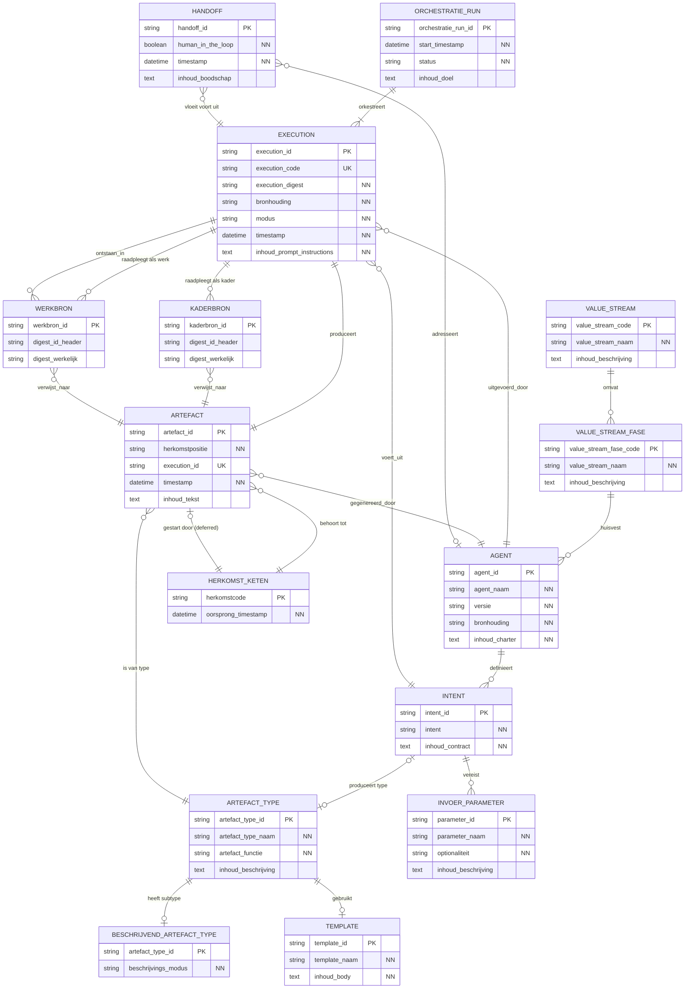

# Logisch Data Model — Mandarin Sleutelset (3NF)

---

## Herkomstverantwoording

Dit document is afgeleid van `tdm_mandarin.md` (versie 1.1, definitief ontwerp) via normalisatie naar de derde normaalvorm (3NF).

**Geraadpleegde bronnen**:
- `tdm_mandarin.md` — leidend datamodel (versie 1.1, gelezen op 2026-04-12)
- `tdm_gegevensregels.md` — gegevensregels Mandarin sleutelset (versie 1.1.0, gelezen op 2026-04-12)

**Opsteller**: Hans Blok  
**Doel**: Normalisatie van het TDM tot de derde normaalvorm als grondslag voor fysieke implementatie

---

## 1. Inleiding

Dit logisch model vertaalt `tdm_mandarin.md` naar een genormaliseerde structuur in de derde normaalvorm (3NF). Partiële afhankelijkheden (2NF) en transitieve afhankelijkheden (3NF) zijn opgeheven. Alle beslissingen zijn gedocumenteerd in §2.

Het logisch model telt **15 entiteiten** (TDM: 13). De twee toevoegingen zijn:
- `BESCHRIJVEND_ARTEFACT_TYPE` — subtype voor het conditionele attribuut `beschrijvings_modus` (N5)
- De VALUE_STREAM_FASE-entiteit is uitgebreid met een expliciet FK-attribuut (N1)

**Modelleringsconventie**: Dit model volgt de Barker-methode. FK-attributen worden niet als zelfstandige attributen opgenomen in child-entiteiten; de relatielijnen drukken de FK-semantiek uit. Uitzonderingen: attributen die zowel PK als FK zijn (subtype-supertype relaties), en attributen met een aanvullende uniekheidsconstraint (UK).

---

## 2. Normalisatiebeslissingen

### N1 — VALUE_STREAM_FASE: keten naar VALUE_STREAM via relatie

**Probleem**: `VALUE_STREAM_FASE.value_stream_fase_code` heeft formaat `<value_stream_code>.<fase_nr>`. De `value_stream_code` was niet als zelfstandig FK-attribuut opgenomen, waardoor de relatie naar VALUE_STREAM niet expliciet verifieerbaar was.

**Oplossing**: De relatie `VALUE_STREAM ||--o{ VALUE_STREAM_FASE` drukt de FK-semantiek uit. De compound PK is hiermee decomponeerbaar via de relatielijnen. Per Barker-conventie wordt `value_stream_code` niet als zelfstandig attribuut opgenomen in VALUE_STREAM_FASE.

---

### N2 — Expliciete FK ARTEFACT → EXECUTION

**Probleem**: Het TDM modelleert `EXECUTION ||--o{ ARTEFACT : "produceert"` maar ARTEFACT bevatte geen `execution_id` FK-attribuut. De relatie was daardoor niet bidirectioneel opvraagbaar.

**Oplossing**: `execution_id` → EXECUTION (verplicht, NN) toegevoegd aan ARTEFACT.

**Cardinaliteitswijziging (N8)**: Eén execution produceert precies één artefact — de relatie is 1:1. `execution_id` is daarmee tevens UK in ARTEFACT. Het UK-attribuut wordt wél opgenomen als zelfstandig attribuut (aanvullende constraint, geen pure FK).

---

### N3 — Expliciete FK EXECUTION → ORCHESTRATIE_RUN

**Probleem**: Het TDM modelleert `ORCHESTRATIE_RUN ||--o{ EXECUTION : "correleert"` maar EXECUTION bevatte geen `orchestratie_run_id` FK-attribuut.

**Oplossing**: De relatie `ORCHESTRATIE_RUN ||--|{ EXECUTION` drukt de FK-semantiek uit. Verplicht (NOT NULL): elke execution behoort tot exact één ORCHESTRATIE_RUN (min=1, max=1). De cardinaliteit is bijgesteld van `||--o{` naar `||--|{`. Per Barker-conventie wordt `orchestratie_run_id` niet als zelfstandig attribuut opgenomen in EXECUTION.

---

### N4 — Verwijdering van transitieve afhankelijkheden in HANDOFF

Het TDM documenteert drie denormalisaties in HANDOFF (§6). Analyse per veld:

| Veld | Transitieketen | Beoordeling | Beslissing |
|------|----------------|-------------|------------|
| `van_agent` | `van_execution` → EXECUTION.`agent_id` | Transitieve afhankelijkheid: volledig afleidbaar | **Verwijderd** |
| `value_stream_fase` | `van_execution` → EXECUTION.`agent_id` → AGENT.`value_stream_fase_code` | Transitieve afhankelijkheid (2 joins diep) | **Verwijderd** |
| `artefact_id` | `van_execution` → EXECUTION (1:1) → ARTEFACT.`artefact_id` | Transitieve afhankelijkheid: volledig afleidbaar via 1:1 relatie EXECUTION → ARTEFACT (N8) | **Verwijderd** |

Alle drie de velden worden verwijderd. De motivatie voor het behoud van `artefact_id` ("één execution kan meerdere artefacten produceren") vervalt door de 1:1 cardinaliteit in N8.

---

### N5 — Subtype-entiteit BESCHRIJVEND_ARTEFACT_TYPE

**Probleem**: `ARTEFACT_TYPE.beschrijvings_modus` is uitsluitend gevuld wanneer `artefact_functie = 'beschrijvend'`. Voor de andere vijf waarden van `artefact_functie` is het attribuut altijd NULL. Dit vormt een conditionele functionele afhankelijkheid die een 3NF-schending is: de waarde is niet van de volledige PK afhankelijk, maar van een combinatie van de PK én de waarde van een ander attribuut.

**Oplossing**: Subtype-entiteit `BESCHRIJVEND_ARTEFACT_TYPE` aangemaakt:
- `artefact_type_id` PK + FK → ARTEFACT_TYPE (1:1 supertype-subtype)
- `beschrijvings_modus` NN (verplicht in het subtype; domein: `verkennend` | `verantwoordend`)

Een rij in `BESCHRIJVEND_ARTEFACT_TYPE` bestaat uitsluitend voor artefact-types met `artefact_functie = 'beschrijvend'`. De wederzijdse consistentie (geen rij zonder `artefact_functie = 'beschrijvend'`, en bij `artefact_functie = 'beschrijvend'` altijd een rij) wordt gehandhaafd via een applicatie-constraint of trigger.

---

### N6 — Circulaire FK: HERKOMST_KETEN ↔ ARTEFACT

**Situatie**: Wederzijdse relaties:
- ARTEFACT → HERKOMST_KETEN via relatie `ARTEFACT }o--|| HERKOMST_KETEN`
- HERKOMST_KETEN → ARTEFACT (initierend) via relatie `HERKOMST_KETEN ||--o| ARTEFACT`

Dit is geen 3NF-schending maar een implementatieconstraint. Per Barker-conventie worden beide FKs uitgedrukt via relatielijnen, niet als zelfstandige attributen.

**Beslissing**: Beide relaties worden opgenomen. De relatie `HERKOMST_KETEN ||--o| ARTEFACT` wordt gemarkeerd als **deferred constraint**: de FK-integriteit wordt uitgesteld tot na de INSERT van het initierende artefact. Aanmaaksvolgorde:

```
1. INSERT HERKOMST_KETEN (initierend_artefact = NULL of deferred)
2. INSERT ARTEFACT (herkomstcode → HERKOMST_KETEN) → artefact_id gegenereerd
3. UPDATE HERKOMST_KETEN SET initierend_artefact = <artefact_id>
```

---

### N8 — Cardinaliteit EXECUTION → ARTEFACT: 1:1

**Beslissing**: Eén execution produceert altijd precies één artefact; nooit meer dan één.

Gevolgen:
- De relatie `EXECUTION ||--o{ ARTEFACT` (1:N) wordt `EXECUTION ||--|| ARTEFACT` (1:1)
- `ARTEFACT.execution_id` krijgt naast FK ook UK (uniekheidsconstraint). Het UK-attribuut wordt wél opgenomen als attribuut (aanvullende constraint, geen pure FK).
- `HANDOFF.artefact_id` was in N4 als directe FK behouden op basis van het argument dat `van_execution` onvoldoende was om het specifieke artefact te identificeren. Dat argument vervalt: bij een 1:1 relatie is `artefact_id` volledig afleidbaar via `van_execution → EXECUTION → ARTEFACT`. Het veld wordt alsnog als transitieve afhankelijkheid verwijderd (N4 herzien).

---

### N7 — EXECUTION.bronhouding: bewaarde afleiding

**Situatie**: `EXECUTION.bronhouding` is transitief afleidbaar via de AGENT-relatie → AGENT.`bronhouding`. Strikt genomen een 3NF-schending.

**Beslissing**: Behouden als bewaarde afleiding (bewuste afwijking van strikte 3NF) omdat:
- De bronhouding een audit-relevant gegeven is dat op uitvoeringstijdstip moet worden vastgelegd
- Toekomstige versiewijzigingen van een agent mogen de bronhouding-registratie van historische executions niet aanpassen
- Dit volgt het event-sourcing-principe: sleutelwaarden worden ingevroren op het moment van de execution

---

## 3. Logisch data model

> **Barker-conventie**: FK-attributen zijn niet opgenomen als zelfstandige attributen in child-entiteiten. De relatielijnen drukken de FK-semantiek uit. Uitzonderingen: `ARTEFACT.execution_id` (FK + UK; opgenomen wegens de uniekheidsconstraint — N8) en `BESCHRIJVEND_ARTEFACT_TYPE.artefact_type_id` (PK + FK in supertype-subtype relatie — N5).



---

## 4. Entiteitdefinities

> **Barker-conventie**: FK-attributen zijn niet opgenomen als zelfstandige attributen in de onderstaande tabellen. Relaties worden vermeld in de **Relaties**-notitie per entiteit. Uitzonderingen: `ARTEFACT.execution_id` (FK + UK) en `BESCHRIJVEND_ARTEFACT_TYPE.artefact_type_id` (PK + FK).

### 4.1 VALUE_STREAM

| Attribuut | Type | Sleutel | NN | Domein / Beschrijving |
|-----------|------|---------|----|-----------------------|
| `value_stream_code` | string | PK | ✓ | Afkorting: `fnd`, `aeo`, `sfw`, ... |
| `value_stream_naam` | string | | ✓ | Volledige naam van de value stream |
| `inhoud_beschrijving` | text | | | Definitie en doel van de waardestroom |

---

### 4.2 VALUE_STREAM_FASE

| Attribuut | Type | Sleutel | NN | Domein / Beschrijving |
|-----------|------|---------|----|-----------------------|
| `value_stream_fase_code` | string | PK | ✓ | Compound: `<value_stream_code>.<fase_nr>` bijv. `sfw.01`, `fnd.02` (BR-012) |
| `value_stream_naam` | string | | ✓ | Beschrijvende naam van de fase |
| `inhoud_beschrijving` | text | | | Omschrijving van wat deze fase behelst |

**Relatie**: → VALUE_STREAM via relatie `VALUE_STREAM ||--o{ VALUE_STREAM_FASE` (N1).

---

### 4.3 TEMPLATE

| Attribuut | Type | Sleutel | NN | Domein / Beschrijving |
|-----------|------|---------|----|-----------------------|
| `template_id` | string | PK | ✓ | Betekenisloos 3-cijferig nummer (BR-015) |
| `template_naam` | string | | ✓ | Beschrijvende naam van de template |
| `inhoud_body` | text | | ✓ | De templatetekst zelf (structurerende inhoud) |

---

### 4.4 ARTEFACT_TYPE

| Attribuut | Type | Sleutel | NN | Domein / Beschrijving |
|-----------|------|---------|----|-----------------------|
| `artefact_type_id` | string | PK | ✓ | Betekenisloos 3-cijferig nummer (BR-029) |
| `artefact_type_naam` | string | | ✓ | Naam: `concept`, `doctrine`, `essay`, `handoff`, ... |
| `artefact_functie` | string | | ✓ | (BR-030): `normerend` \| `structurerend` \| `vastleggend` \| `realiserend` \| `evaluerend` \| `beschrijvend` |
| `inhoud_beschrijving` | text | | | Definitie en toepassing van dit artefacttype |

**Relatie**: → TEMPLATE (optioneel) via relatie `ARTEFACT_TYPE ||--o| TEMPLATE`.

**3NF-noot**: `beschrijvings_modus` is verplaatst naar `BESCHRIJVEND_ARTEFACT_TYPE` (N5). Wanneer `artefact_functie = 'beschrijvend'`, bestaat er een corresponderende rij in het subtype.

---

### 4.5 BESCHRIJVEND_ARTEFACT_TYPE *(subtype — toegevoegd in 3NF)*

| Attribuut | Type | Sleutel | NN | Domein / Beschrijving |
|-----------|------|---------|----|-----------------------|
| `artefact_type_id` | string | PK, FK | ✓ | → ARTEFACT_TYPE.`artefact_type_id`; bestaat uitsluitend voor types met `artefact_functie = 'beschrijvend'` |
| `beschrijvings_modus` | string | | ✓ | (BR-032): `verkennend` \| `verantwoordend` |

**3NF-noot**: Door het subtype is `beschrijvings_modus` altijd NN (nooit NULL) binnen deze entiteit. De supertype-constraint "als `artefact_functie = 'beschrijvend'` dan bestaat rij in subtype, en vice versa" is een applicatieconstraint (N5). `artefact_type_id` is hier zowel PK als FK — uitzondering op de Barker-conventie voor subtype-supertype relaties.

---

### 4.6 AGENT

| Attribuut | Type | Sleutel | NN | Domein / Beschrijving |
|-----------|------|---------|----|-----------------------|
| `agent_id` | string | PK | ✓ | Compound: `<value_stream>.<versie>.<naam>` (BR-013) |
| `agent_naam` | string | | ✓ | Korte, leesbare naam |
| `versie` | string | | ✓ | Semantische versie (semver) |
| `bronhouding` | string | | ✓ | (BR-028): `input-gebonden` \| `canon-gebonden` \| `workspace-gebonden` \| `extern-gebonden` \| `exploratief` |
| `inhoud_charter` | text | | ✓ | Agent charter: capabilities, gedragscontract en grenzen |

**Relatie**: → VALUE_STREAM_FASE via relatie `VALUE_STREAM_FASE ||--o{ AGENT`.

---

### 4.7 INTENT

| Attribuut | Type | Sleutel | NN | Domein / Beschrijving |
|-----------|------|---------|----|-----------------------|
| `intent_id` | string | PK | ✓ | Compound: `<agent_id>.<intent>` (BR-014) |
| `intent` | string | | ✓ | Naam van de intent |
| `inhoud_contract` | text | | ✓ | Intentcontract: precondities, postcondities, verwachte output en gedragsregels |

**Relaties**: → AGENT via relatie `AGENT ||--o{ INTENT`; → ARTEFACT_TYPE (optioneel) via relatie `INTENT |o--o| ARTEFACT_TYPE`.

**Alternatieve sleutel**: AK(AGENT-relatie, `intent`) — de combinatie van agent en intent-naam is uniek (BR-014).

---

### 4.8 INVOER_PARAMETER

| Attribuut | Type | Sleutel | NN | Domein / Beschrijving |
|-----------|------|---------|----|-----------------------|
| `parameter_id` | string | PK | ✓ | Betekenisloos 4-cijferig nummer (BR-016) |
| `parameter_naam` | string | | ✓ | Naam van de parameter |
| `optionaliteit` | string | | ✓ | `verplicht` (default) \| `optioneel` |
| `inhoud_beschrijving` | text | | | Toelichting op de parameter |

**Relatie**: → INTENT via relatie `INTENT ||--o{ INVOER_PARAMETER`.

---

### 4.9 ORCHESTRATIE_RUN

| Attribuut | Type | Sleutel | NN | Domein / Beschrijving |
|-----------|------|---------|----|-----------------------|
| `orchestratie_run_id` | string | PK | ✓ | Pipeline-identifier: `run-JJMM.XXXX` (BR-011) |
| `start_timestamp` | datetime | | ✓ | Starttijdstip van de run (ISO 8601) |
| `status` | string | | ✓ | (BR-021): `running` \| `completed` \| `failed` |
| `inhoud_doel` | text | | | Doel en scope van deze orchestratierun |

---

### 4.10 EXECUTION

| Attribuut | Type | Sleutel | NN | Domein / Beschrijving |
|-----------|------|---------|----|-----------------------|
| `execution_id` | string | PK | ✓ | Kern-id: `JJMM.XXXX` |
| `execution_code` | string | UK | ✓ | Afgeleid externe referentie: `exec-` + `execution_id` (BR-005) |
| `execution_digest` | string | | ✓ | Inhoudsgebonden hash/digest |
| `bronhouding` | string | | ✓ | (BR-028); bewaard als event-sourcing gegeven (N7) |
| `modus` | string | | ✓ | (BR-020): `handmatig` \| `tool-ondersteund` |
| `timestamp` | datetime | | ✓ | Uitvoeringstijdstip (ISO 8601) |
| `inhoud_prompt_instructions` | text | | ✓ | De gebruikte prompt en instructies voor deze execution |

**Relaties**: → AGENT via `EXECUTION }o--|| AGENT`; → INTENT via `EXECUTION }o--|| INTENT`; → ORCHESTRATIE_RUN via `ORCHESTRATIE_RUN ||--|{ EXECUTION` (N3, verplicht NOT NULL).

---

### 4.11 HERKOMST_KETEN

| Attribuut | Type | Sleutel | NN | Domein / Beschrijving |
|-----------|------|---------|----|-----------------------|
| `herkomstcode` | string | PK | ✓ | Ketenidentifier: `JJMM.XXXX` (BR-001, BR-004) |
| `oorsprong_timestamp` | datetime | | ✓ | Tijdstip van keten-initiatie (ISO 8601) |

**Relatie**: → ARTEFACT (initierend) via relatie `HERKOMST_KETEN ||--o| ARTEFACT` **[deferred constraint — N6]**.

---

### 4.12 ARTEFACT

| Attribuut | Type | Sleutel | NN | Domein / Beschrijving |
|-----------|------|---------|----|-----------------------|
| `artefact_id` | string | PK | ✓ | Pad-onafhankelijke identifier: `art-JJMM.XXXX` (BR-010) |
| `herkomstpositie` | string | | ✓ | (BR-018): `initierend` \| `voortbouwend` |
| `execution_id` | string | UK | ✓ | Producerende execution; uniek (1:1 per **N8**). FK via relatie `EXECUTION ||--|| ARTEFACT`. |
| `timestamp` | datetime | | ✓ | Creatietijdstip (ISO 8601) |
| `inhoud_tekst` | text | | | Volledige inhoudstekst van het artefact |

**Relaties**: → HERKOMST_KETEN via `ARTEFACT }o--|| HERKOMST_KETEN`; → ARTEFACT_TYPE via `ARTEFACT }o--|| ARTEFACT_TYPE`; → AGENT via `ARTEFACT }o--|| AGENT`.

**3NF-noot**: `execution_id` is als attribuut opgenomen wegens de UK-constraint (N8). De FK-semantiek wordt uitgedrukt via de relatielijnen conform Barker-conventie.

---

### 4.13 HANDOFF

| Attribuut | Type | Sleutel | NN | Domein / Beschrijving |
|-----------|------|---------|----|-----------------------|
| `handoff_id` | string | PK | ✓ | Overdrachtsidentifier: `hf-JJMM.NNNN` (BR-006) |
| `human_in_the_loop` | boolean | | ✓ | `TRUE` bij menselijke interventie, anders `FALSE` |
| `timestamp` | datetime | | ✓ | Overdrachtstijdstip (ISO 8601) |
| `inhoud_boodschap` | text | | | Overdrachtscontext en instructies voor de ontvangende agent |

**Relaties**: → EXECUTION via `HANDOFF }o--|| EXECUTION`; → AGENT (optioneel) via `HANDOFF }o--o| AGENT`.

**3NF-noot**: `van_agent`, `value_stream_fase` én `artefact_id` verwijderd als transitieve afhankelijkheden (N4, herzien door N8). `van_execution` en `naar_agent` worden uitgedrukt via relatielijnen conform Barker-conventie. `artefact_id` is afleidbaar via `van_execution → EXECUTION (1:1) → ARTEFACT`.

---

### 4.14 KADERBRON

| Attribuut | Type | Sleutel | NN | Domein / Beschrijving |
|-----------|------|---------|----|-----------------------|
| `kaderbron_id` | string | PK | ✓ | Betekenisloos 8-cijferig nummer (BR-017) |
| `digest_id_header` | string | | | Verwachte digest (uit header/referentie van het geraadpleegde artefact) |
| `digest_werkelijk` | string | | | Actuele digest op raadpleegmoment |

**Relaties**: → EXECUTION (raadplegend) via `EXECUTION ||--o{ KADERBRON`; → ARTEFACT via `KADERBRON }o--|| ARTEFACT`.

**Alternatieve sleutel**: AK(EXECUTION-relatie, ARTEFACT-relatie) — een artefact wordt per execution maximaal één keer als kaderbron geregistreerd.

---

### 4.15 WERKBRON

| Attribuut | Type | Sleutel | NN | Domein / Beschrijving |
|-----------|------|---------|----|-----------------------|
| `werkbron_id` | string | PK | ✓ | Betekenisloos 8-cijferig nummer (BR-019) |
| `digest_id_header` | string | | | Verwachte digest (uit header/referentie) |
| `digest_werkelijk` | string | | | Actuele digest op raadpleegmoment |

**Relaties**: → EXECUTION (raadplegend) via `EXECUTION ||--o{ WERKBRON`; → EXECUTION (bronhouder) via `WERKBRON }o--|| EXECUTION`; → ARTEFACT via `WERKBRON }o--|| ARTEFACT`.

**Alternatieve sleutel**: AK(EXECUTION-raadplegend-relatie, ARTEFACT-relatie) — een artefact wordt per execution maximaal één keer als werkbron geregistreerd.

---

## 5. Constraints

### 5.1 Check-constraints

| # | Entiteit | Constraint | Gegevensregel |
|---|----------|------------|---------------|
| CK-01 | ARTEFACT_TYPE | `artefact_functie IN ('normerend','structurerend','vastleggend','realiserend','evaluerend','beschrijvend')` | BR-030 |
| CK-02 | BESCHRIJVEND_ARTEFACT_TYPE | `beschrijvings_modus IN ('verkennend','verantwoordend')` | BR-032 |
| CK-03 | ARTEFACT | `herkomstpositie IN ('initierend','voortbouwend')` | BR-018 |
| CK-04 | EXECUTION | `modus IN ('handmatig','tool-ondersteund')` | BR-020 |
| CK-05 | EXECUTION | `bronhouding IN ('input-gebonden','canon-gebonden','workspace-gebonden','extern-gebonden','exploratief')` | BR-028 |
| CK-06 | AGENT | `bronhouding IN ('input-gebonden','canon-gebonden','workspace-gebonden','extern-gebonden','exploratief')` | BR-028 |
| CK-07 | ORCHESTRATIE_RUN | `status IN ('running','completed','failed')` | BR-021 |
| CK-08 | HANDOFF | `human_in_the_loop = TRUE → naar_agent IS NULL` | BR-009 |
| CK-09 | HANDOFF | `human_in_the_loop = FALSE → naar_agent IS NOT NULL` | impliciet BR-009 |
| CK-10 | INVOER_PARAMETER | `optionaliteit IN ('verplicht','optioneel')` | TDM §3.5 |

### 5.2 Alternatieve sleutels (AK)

| # | Entiteit | AK-attributen | Omschrijving |
|---|----------|---------------|--------------|
| AK-01 | EXECUTION | `execution_code` | Externe referentie (UK reeds in TDM) |
| AK-02 | INTENT | `(AGENT-relatie, intent)` | Compound naam-uniekheid via relatie naar AGENT en attribuut `intent` (BR-014) |
| AK-03 | KADERBRON | `(EXECUTION-relatie, ARTEFACT-relatie)` | Één registratie per artefact per execution |
| AK-04 | WERKBRON | `(EXECUTION-raadplegend-relatie, ARTEFACT-relatie)` | Één registratie per artefact per execution |
| AK-05 | ARTEFACT | `execution_id` | Één artefact per execution (1:1 — N8) |

### 5.3 Deferred constraints

| # | Entiteit | Relatie | Reden |
|---|----------|---------|-------|
| DC-01 | HERKOMST_KETEN | `HERKOMST_KETEN ||--o| ARTEFACT` (initierend) | Circulaire FK met ARTEFACT; ARTEFACT moet eerst bestaan voordat de relatie kan worden gerealiseerd (N6) |

### 5.4 Applicatieconstraints (niet in DDL uit te drukken)

| # | Entiteit | Constraint |
|---|----------|------------|
| AC-01 | ARTEFACT_TYPE / BESCHRIJVEND_ARTEFACT_TYPE | Als `artefact_functie = 'beschrijvend'` dan bestaat er een rij in BESCHRIJVEND_ARTEFACT_TYPE met hetzelfde `artefact_type_id`; en vice versa (N5) |
| AC-02 | EXECUTION | `execution_code = 'exec-' \|\| execution_id` — gegenereerd bij aanmaken, onveranderlijk (BR-005) |

---

## 6. Overzicht: TDM vs. 3NF Logisch Model

| Entiteit | In TDM | In 3NF | Wijziging |
|----------|--------|--------|-----------|
| VALUE_STREAM | ✓ | ✓ | `inhoud_beschrijving` toegevoegd |
| VALUE_STREAM_FASE | ✓ | ✓ | Relatie naar VALUE_STREAM via relatielijn (N1); `inhoud_beschrijving` toegevoegd |
| TEMPLATE | ✓ | ✓ | `inhoud_body` toegevoegd |
| ARTEFACT_TYPE | ✓ | ✓ | `beschrijvings_modus` verplaatst naar subtype (N5); `template_id` via relatielijn; `inhoud_beschrijving` toegevoegd |
| BESCHRIJVEND_ARTEFACT_TYPE | — | ✓ | Nieuw: subtype voor `artefact_functie = 'beschrijvend'` (N5) |
| AGENT | ✓ | ✓ | `inhoud_charter` toegevoegd; `value_stream_fase_code` via relatielijn |
| INTENT | ✓ | ✓ | `agent_id` en `artefact_type_id` via relatielijnen; AK gedocumenteerd; `inhoud_contract` toegevoegd |
| INVOER_PARAMETER | ✓ | ✓ | `intent_id` via relatielijn; `beschrijving` hernoemd naar `inhoud_beschrijving` |
| ORCHESTRATIE_RUN | ✓ | ✓ | `inhoud_doel` toegevoegd |
| EXECUTION | ✓ | ✓ | Relaties naar AGENT, INTENT, ORCHESTRATIE_RUN via relatielijnen (N3); `inhoud_prompt_instructions` toegevoegd |
| HERKOMST_KETEN | ✓ | ✓ | `initierend_artefact` via relatielijn; deferred constraint gedocumenteerd (N6) |
| ARTEFACT | ✓ | ✓ | `execution_id UK` toegevoegd (N2, N8); FKs via relatielijnen; relatie naar EXECUTION is 1:1; `inhoud_tekst` toegevoegd |
| HANDOFF | ✓ | ✓ | `van_agent`, `value_stream_fase`, `artefact_id` verwijderd (N4, herzien door N8); FKs via relatielijnen; `inhoud_boodschap` toegevoegd |
| KADERBRON | ✓ | ✓ | FKs via relatielijnen; AK gedocumenteerd |
| WERKBRON | ✓ | ✓ | FKs via relatielijnen; AK gedocumenteerd |

---

## Wijzigingslog

| Datum | Versie | Wijziging | Auteur |
|-------|--------|-----------|--------|
| 2026-04-12 | 1.0.0 | Initiële versie: normalisatie van TDM v1.1 naar 3NF; 7 normalisatiebeslissingen; 15 entiteiten | Hans Blok |
| 2026-04-12 | 1.1.0 | Inhoudsattributen toegevoegd (`inhoud_` prefix): 10 entiteiten uitgebreid; `INVOER_PARAMETER.beschrijving` hernoemd naar `inhoud_beschrijving` | Hans Blok |
| 2026-04-12 | 1.2.0 | N8 toegevoegd: EXECUTION → ARTEFACT is 1:1; `ARTEFACT.execution_id` wordt UK; `HANDOFF.artefact_id` verwijderd als nu-transitieve afhankelijkheid (N4 herzien) | Hans Blok |
| 2026-04-13 | 1.3.0 | Barker-conventie toegepast: FK-only attributen verwijderd uit alle child-entiteiten; FK-semantiek uitgedrukt via relatielijnen. Relaties functioneel benoemd. N1 en N3 bijgewerkt. AK-02, AK-03, AK-04 en DC-01 geherformuleerd. | Hans Blok |
